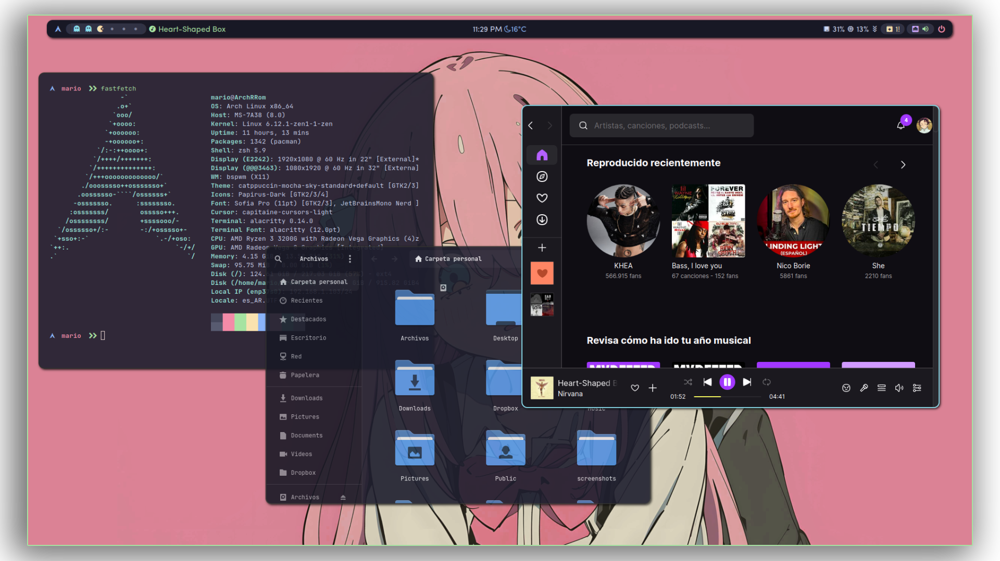
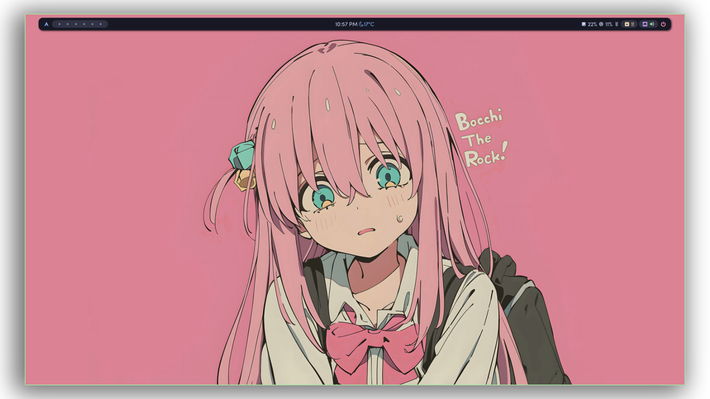
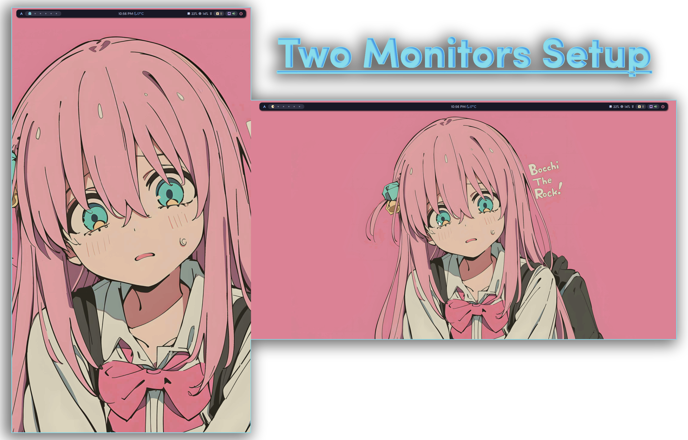
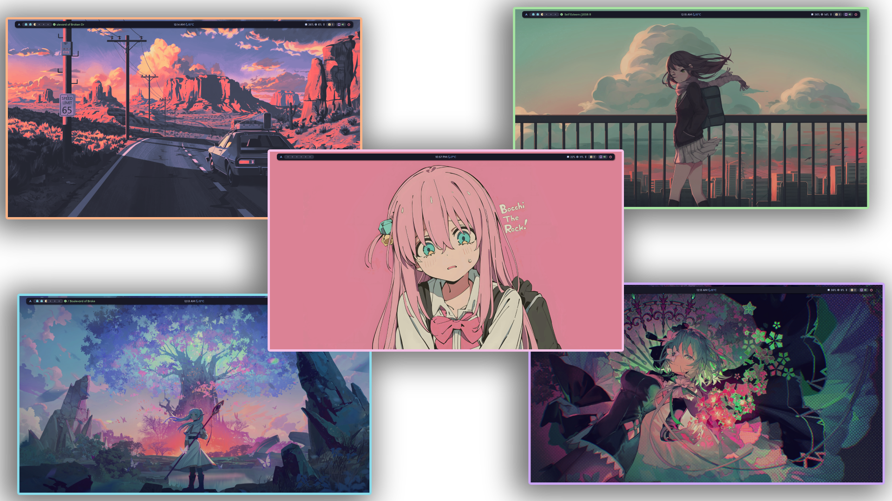
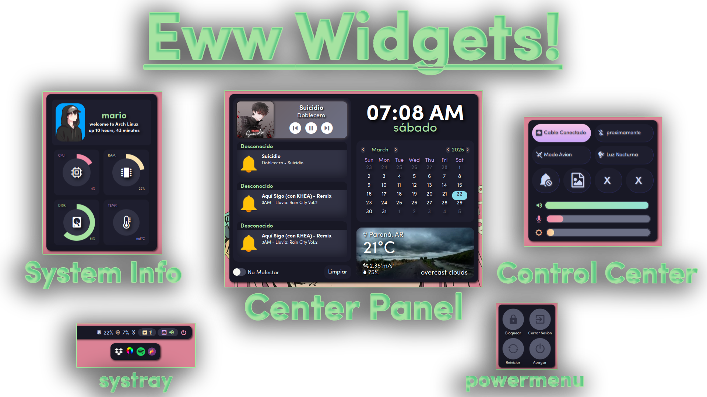

# **Mario's BSPWM DOTFILES**

## ✨ ¡Bienvenido a mi entorno! 🎨

Este es mi entorno gráfico basado en **BSPWM**, diseñado con un toque **minimalista y elegante**, pensado para situaciones en las que disponemos de múltiples monitores, donde mi entorno se adapta sin problemas a estos, dando soporte completo a las pantallas y disposiciones que desees.  
Mi entorno está enfocado para tener un **workflow rápido** al programar, trabajar o realizar tareas cotidianas, ¡y quizás algo de gaming, por qué no! 🤠  

---

### **🛠️ Detalles del Entorno**

| Componente                | Herramienta                   |
|---------------------------|-------------------------------|
| **WM**                    | BSPWM                         |
| **Bar**                   | Polybar                       |
| **Widgets**               | Eww                           |
| **Terminal**              | Alacritty                     |
| **Launcher**              | Rofi                          |
| **Gestor de Archivos**    | Nautilus                      |
| **Notificaciones**        | Dunst                         |
| **Compositor**            | Picom                         |
| **Wallpapers**            | Feh                           |

---

### **🔧 Polybar: La barrita de arriba, pibe 🤠**

La **Polybar** ofrece una barra minimalista sin estar sobrecargada de datos, pero a la vez proporciona información rápida, ¡y no deja de ser bonita! ❤️  
**Se ejecuta en todos los monitores**, asegurando que cada pantalla tenga su propia barra sincronizada.

---

### **🖥️ Compatibilidad Multi-Monitor**

Mi entorno es amigable con setups en los que dispongas de distintos monitores, haciendo compatible los espacios de trabajo, la Polybar y los widgets de Eww, ahorrándote muchos dolores de cabeza.  

---

### **🖼️ Feh: Los wallpapers, pa 😎**

**Feh** es el encargado de gestionar los fondos de pantalla en este entorno. Te permite elegir entre un fondo fijo o activar el modo **aleatorio**, donde cada inicio de sesión selecciona un wallpaper diferente de la lista.  
Mis dotfiles vienen equipados con varios fondos, pero también puedes hacer un cambio rápido en el **control center** o colocar los tuyos propios. 🤷‍♂️

---

### **💻 Eww: Widgets Funcionales y Bonitos ❤️**

Los **widgets de Eww** son la clave, diseñados cada uno para una función en concreto, sin dejar de ser bonitos y dar información rápida y a la mano.  
Están adaptados para abrirse en el monitor donde ejecutas la acción, reforzando la compatibilidad **Multi-Monitor**. Vamos, que son piola, amigo. 🤠

**Widgets disponibles:**
- **System Info:** Muestra el uso de CPU, RAM, disco, temperatura, tiempo de actividad y más.
- **Center Panel:** Contiene la fecha, hora, calendario, clima y notificaciones.
- **Control Center:** Accede rápidamente a configuraciones como volumen, brillo, red y más.
- **Powermenu:** Botones rápidos para apagar, reiniciar o bloquear el sistema.
- **Systray:** Muestra aplicaciones en segundo plano.
- **Popups:** Popups de Volumen y Brillo.

---

### **🎨 Colorscheme: Catppuccin Mocha GTK**

El esquema de colores que utilizo en mi entorno, así como en el resto de las aplicaciones, es el tema **Catppuccin Mocha Sky**. Me parece un esquema de colores muy bonito y cómodo para la vista, por eso es uno de mis favoritos! 🙈

---

> [!Advertencia]
> Mis Dotfiles fueron diseñados para una resolución de **1920x1080**
> Si utilizas resoluciones demaciado bajas es probable que la escala de los widgets sea demaciado grande.

> [!importante]
> Si estas usando una maquina virtual, asegurate de cambiar el backend de picom de **glx** a **xrender** antes de iniciar el entorno.
> La configuracion esta en `.config/bspwm/config/picom/picom.conf`

### **🚀 Instalación**

¿Te interesa probar este entorno? Dirígete a la guía de instalación en [INSTALACION.md](./INSTALACION.md) para configurarlo en tu sistema. Todo lo que necesitas está explicado paso a paso. 🛠️

---

### **📋 Guía**

Si quieres más detalles sobre atajos de teclado, configuraciones adicionales y más información, puedes revisar la [GUIA.md](./GUIA.md) para aprender todo sobre el funcionamiento de mi entorno papu.

---

### **💡 Inspiraciones**

Me inspiré en los siguientes dotfiles, un saludo y cálido abrazo a todos ellos, ¡son unos grandes! ❤️

- [Syndrizzle](https://github.com/syndrizzle/hotfiles/tree/bspwm)  
- [Raexera](https://github.com/raexera/tokyo)  
- [Ghostzk](https://github.com/gh0stzk/dotfiles)  
- [Axarva](https://github.com/Axarva/dotfiles-2.0)

---

¡Gracias por pasar por aquí! Saludos desde Argentina, pa! 🇦🇷❤️